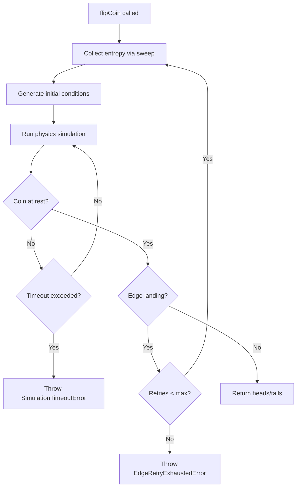

# Flip-Coin: Physics-Based Coin Flip Simulator

## Project Requirements

### Core Goal
A TypeScript library exposing `flipCoin()` that simulates a **physically realistic** coin toss using 3D rigid body dynamics. The outcome should be **as truly unpredictable as possible** , even if the source code is available and open to inspection.

> [NOTE]:
> The code snippets in this whole document are not to be taken as a literal implementation. They are just for reference, to show
> what the physics engine might look like.

### Non-Negotiables
| Requirement | Rationale |
|-------------|-----------|
| No `Math.random()` or weak PRNGs | Predictable seeds = predictable outcomes |
| True entropy sources only | Security through obscurity is not acceptable |
| Full 3D physics simulation | Rigid body dynamics with gravity, drag, torque |
| Edge landing detection | Auto-retry if coin lands on edge |
| Configurable entropy quality | Trade time for more randomness |

---

## Architecture Overview

```
┌─────────────────────────────────────────────────────────────────┐
│                         flipCoin() API                          │
├─────────────────────────────────────────────────────────────────┤
│                      Simulation Controller                      │
│         (orchestrates entropy → physics → result)               │
├───────────────────┬─────────────────────┬───────────────────────┤
│   Entropy System  │   Physics Engine    │   Result Evaluator    │
│                   │                     │                       │
│  • Entropy Pool   │  • Rigid Body       │  • Orientation Check  │
│  • Source Mixer   │  • Collision        │  • Edge Detection     │
│  • Quality Meter  │  • Integration      │  • Face Determination │
└───────────────────┴─────────────────────┴───────────────────────┘
```

---

## Module Design

### 1. Entropy System (`/src/entropy/`)

The heart of true randomness. Collects, mixes, and provides entropy for initial conditions.

#### Sources (prioritized by quality)

| Source | Type | Entropy Quality | Availability | Timeout | 
|--------|------|-----------------|--------------|---------|
| `crypto.getRandomValues()` | OS entropy | 4 of 5 | Always available | 100ms | 
| High-res timer jitter | Hardware | ~3 of 5 | Always available | 200ms |
| Quantum RNG API | External | 5 of 5 | Network required | 3000ms |
| User input timing | Behavioral | 4 of 5 | User interaction | 500ms |
| Audio noise | Hardware | 3.5 of 5 | Microphone access | 1000ms | 

> [NOTE]:
> **Source Timeouts & Failures:** Each entropy source has a per-source timeout. If a source times out, throws an error, or requires a permission that is denied, it is **silently skipped**. The system works with whatever entropy sources are available. This ensures `flipCoin()` never blocks indefinitely or fails due to a single uncooperative source. The minimum viable scenario is timer jitter alone (always available).

#### Entropy Pool Architecture
```
┌──────────────────────────────────────────────────────────┐
│              collectEntropy() - Current Implementation   │
├──────────────────────────────────────────────────────────┤
│  Sources → Mixing Function → Expansion → Output          │
│                                                          │
│  • Each source contributes bits independently            │
│  • Mixing uses cryptographic hash (SHA-256)              │
│  • No persistent buffer - each call is independent       │
│  • Graceful degradation if target bits not met           │
└──────────────────────────────────────────────────────────┘
```

#### Quality Presets

| Preset | Min Time | Target Entropy | Use Case |
|--------|----------|----------------|----------|
| `fast` | 100ms | 64 bits | Quick demos |
| `standard` | 200ms | 128 bits | Normal use |
| `high` | 500ms | 256 bits | Important decisions |
| `paranoid` | 2000ms | 512 bits | Maximum randomness |

> [NOTE]:
> **Graceful Degradation:** The target entropy is a goal, not a hard requirement. If the target cannot be met within `maxTimeMs`, the system proceeds with whatever entropy was collected (as long as at least one source succeeded). This ensures the "minimum viable timer jitter" requirement is honored. Only if ALL sources fail does collection throw an error.

> [NOTE]:
> The entropy system always performs a **complete sweep of all available sources** (entropy accumulation principle), regardless of which ones succeed. This ensures maximum entropy mixing and prevents reliance on any single source.

---

### 2. Physics Engine (`/src/physics/`)

Full 3D rigid body simulation with realistic dynamics.

#### Coin Model

```typescript
interface CoinState {
  // Physical properties
  radius: number;          // meters
  thickness: number;       // meters
  mass: number;            // kg
  momentOfInertia: Mat3;   // derived from geometry
  
  // State variables
  position: Vec3;          // center of mass
  orientation: Quaternion; // rotation state
  linearVelocity: Vec3;    // m/s
  angularVelocity: Vec3;   // rad/s
}
```

#### Forces & Effects

| Force | Formula | Purpose |
|-------|---------|---------|
| Gravity | `F = m * g` | Downward acceleration |
| Air drag (linear) | `F = -½ρCdAv²` | Velocity damping |
| Air drag (angular) | `τ = -kω` | Spin damping |
| Collision impulse | `J = -(1+e)v·n / (1/m)` | Bounce response |

#### Integration Method

**RK4 (Runge-Kutta 4th order)** for accuracy:
- Fixed timestep: 0.0001s (10,000 Hz)
- Handles stiff collision dynamics
- Numerically stable — does not introduce spurious energy gain or loss beyond the modeled drag and collision damping

> [NOTE]:
> The 10kHz timestep is a starting point and hasnt been performance tested yet. This may result in 50,000+ steps for a typical flip. We might later consider profiling early and potentially using adaptive timesteps or a looser fixed step if performance is an issue.

**Quaternion Integration Considerations:**
- Angular velocity → quaternion derivative: `q' = 0.5 * ω * q`
- Must renormalize quaternion after each step to prevent numerical drift
- This is a common source of bugs in rigid body simulations

#### Collision Detection

```
Ground plane: y = 0

Collision check:
  - Compute lowest point of coin disc
  - If y < 0: collision detected
  - Compute contact normal, penetration depth
  - Apply impulse with restitution coefficient
  - Apply friction (Coulomb model)
```

#### Settling Behavior (Rocking to Rest)

Coins don't just "stick" after the final bounce in the real world, they rock and wobble a lot before settling flat. This behavior **should emerge naturally** from the physics simulation:

1. **Low-energy collisions:** As the coin loses energy, bounces become smaller.
2. **Edge contact → torque:** When one edge touches the ground while the coin is tilted, friction and normal forces create a torque that tips the coin.
3. **Damping:** Angular drag gradually dissipates the rocking motion.
4. **Final state:** The coin settles flat when rocking amplitude drops below the stability threshold.

---

### 3. Result Evaluator (`/src/evaluator/`)

Determines the final outcome once the coin stabilizes.

#### Stability Criteria

The coin is "at rest" when ALL conditions are met:
- `|angularVelocity.x| < 0.01 rad/s` AND `|angularVelocity.z| < 0.01 rad/s` (tumbling stopped)
- `|linearVelocity| < 0.001 m/s`
- `position.y` is stable (not bouncing)
- Conditions held for 10+ consecutive frames

> [NOTE]:
> We intentionally check only the X and Z components of angular velocity (the "tumbling" axes). Spin around the Y axis (coin spinning like a top while flat) doesn't affect the outcome and can persist longer due to lower friction. This prevents false "still settling" states.

#### Face Determination

```typescript
export type Face = 'heads' | 'tails' | 'edge';
function determineFace(orientation: Quaternion): Face {
  const upVector = orientation.rotate(Vec3.UP);  // coin's local "up"
  const dotWithWorldUp = upVector.dot(Vec3.Y);
  
  if (dotWithWorldUp > 0.99) return 'heads';
  if (dotWithWorldUp < -0.99) return 'tails';
  return 'edge';  // triggers retry
}
// Note: 0.99 threshold (~8°) is intentionally aggressive/optimistic.
// May need relaxing to ~0.95 (~18°) if we see excessive edge retries in practice.
```

---

### 4. Simulation Controller (`/src/simulation/`)

Orchestrates the full flip process.

#### Flow



#### Initial Condition Generation

Using entropy, generate randomized initial conditions. usage of valid ranges prevents non-physical or 'boring' outcomes (like a coin that doesn't flip).

**Default "Human Toss" Profile (Configurable):**
- **Height:** 0.3m - 0.5m (hand toss height)
- **Orientation:** random quaternion
- **Linear velocity:** 2-5 m/s (approx. 0.5s air time)
- **Angular velocity:** 60-300 rad/s (ensures 5-25 full rotations over ~0.5s air time)

*Note: These ranges are fully configurable via the API. The engine supports "super-human" tosses or mechanical drops as long as physics integration steps are adjusted for stability.*

Small perturbations added to each value for chaos sensitivity.

**Initial Condition Validation:**
Before starting the simulation, the generated initial conditions are validated:
- `position.y > 0` (coin must start above ground)
- `|angularVelocity| > minimum threshold` (ensures the coin actually flips)

If validation fails (e.g., due to malformed `DebugFlipOptions.initialConditions` or extreme perturbations), the system regenerates new initial conditions using fresh entropy. This retry loop is capped to prevent infinite loops.

> [IMPORTANT]:
> **The physics simulation itself is fully deterministic.** Given identical initial conditions and timestep, JavaScript's floating-point math will produce the exact same trajectory every time. The unpredictability of each flip comes *entirely* from entropy-seeded initial conditions. This is by design as it allows deterministic replay for local debugging (via the debug API) while ensuring production flips are unpredictable.

> [WARNING]:
> **Debug replay is probably going to be local-only.** Floating-point determinism is NOT guaranteed across different JavaScript engines (V8/SpiderMonkey/JSC), CPU architectures (x86/ARM), or JIT optimization states. A seed that replays correctly on your machine may produce a different trajectory on another device. The debug API is intended for local development and debugging, not cross-platform reproducibility.

---

## API Design

```typescript
// ============ PRODUCTION API ============
export async function flipCoin(options?: FlipOptions): Promise<FlipResult>;

// Configuration
type EntropyLevel = 'fast' | 'standard' | 'high' | 'paranoid';
interface FlipOptions {
  entropyLevel?: EntropyLevel;
  coin?: CoinConfig;
  tossProfile?: TossProfile; // customize toss characteristics
  timeout?: number;       // max wall-clock simulation time in ms (default: 5000)
                          // If exceeded, throws SimulationTimeoutError
  maxEdgeRetries?: number; // max retries if coin lands on edge (default: 5)
                          // Throws EdgeRetryExhaustedError if exceeded
}

interface TossProfile {
  heightRange?: [number, number];          // meters, default: [0.3, 0.5]
  linearVelocityRange?: [number, number];  // m/s, default: [2, 5]
  angularVelocityRange?: [number, number]; // rad/s, default: [60, 300]
}

interface CoinConfig {
  radius?: number;      // default: 0.012m (quarter-sized)
  thickness?: number;   // default: 0.002m
  mass?: number;        // default: 0.00567kg
}

// Result
interface FlipResult {
  outcome: Exclude<Face, 'edge'>; //result cant be edge, if it was edge, it would trigger a retry until it was heads or tails
  stats: {
    simulationTime: number;    // how long physics ran (wall-clock ms)
    entropyBitsUsed: number;   // entropy consumed
    bounceCount: number;       // collision events
    retryCount: number;        // edge landing retries
  };
}

// ============ DEBUG API (dev only) ============
// Separate export to keep prod bundle clean
export async function debugFlipCoin(options?: DebugFlipOptions): Promise<DebugFlipResult>;

interface DebugFlipOptions extends FlipOptions {
  seed?: Uint8Array;           // manual entropy seed for deterministic replay
  recordTrajectory?: boolean;  // capture full physics state history
  initialConditions?: {        // override random initial conditions
    position?: Vec3;
    orientation?: Quaternion;
    linearVelocity?: Vec3;
    angularVelocity?: Vec3;
  };
}

interface DebugFlipResult extends FlipResult {
  seed: Uint8Array;            // entropy used (for replay)
  trajectory?: CoinState[];    // full state history if recorded
  initialConditions: {         // actual initial conditions used
    position: Vec3;
    orientation: Quaternion;
    linearVelocity: Vec3;
    angularVelocity: Vec3;
  };
}
```

---

## Project Structure

```
flip-coin/
├── src/
│   ├── index.ts              # Public API exports
│   ├── common/
│   │   └── errors/
│   │       └── BaseError.ts  # Base error class for all custom errors
│   ├── entropy/
│   │   ├── errors/           # Entropy-specific error classes
│   │   ├── pool.ts           # Entropy pool management
│   │   ├── sources/
│   │   │   ├── timing.ts     # High-res timer jitter
│   │   │   ├── input.ts      # Mouse/keyboard entropy
│   │   │   ├── audio.ts      # Microphone noise
│   │   │   └── quantum.ts    # External QRNG API
│   │   └── mixer.ts          # Hash-based mixing
│   ├── physics/
│   │   ├── errors/           # Physics-specific error classes
│   │   ├── rigid-body.ts     # Coin physics state
│   │   ├── forces.ts         # Gravity, drag calculations
│   │   ├── collision.ts      # Ground collision handling
│   │   ├── integrator.ts     # RK4 integration
│   │   └── math/
│   │       ├── vec3.ts       # 3D vector operations
│   │       ├── mat3.ts       # 3x3 matrix (inertia tensor)
│   │       └── quaternion.ts # Rotation representation
│   ├── simulation/
│   │   ├── errors/           # Simulation-specific error classes
│   │   ├── controller.ts     # Main simulation loop
│   │   ├── initial.ts        # Initial condition generator
│   │   └── stability.ts      # Rest detection
│   └── evaluator/
│       ├── errors/           # Evaluator-specific error classes
│       └── face.ts           # Determine heads/tails/edge
├── visualization/            # Optional Three.js debugger
│   ├── scene.ts
│   └── coin-mesh.ts
├── tests/
├── package.json
├── tsconfig.json
└── README.md
```

---

## Verification Plan

### Automated Tests
- Unit tests for each physics component
- Statistical tests: run 10,000 flips, verify ~50/50 distribution
- Entropy quality tests: randomness test suites (NIST, Diehard)

### Manual Verification
- Visual debugging with Three.js renderer
- Physics plausibility checks (energy conservation, realistic trajectories)

---

## Design Decisions

| Decision | Choice | Rationale |
|----------|--------|----------|
| Network requirement | Optional | Graceful degradation to local sources; users accept reduced entropy if offline |
| Browser + Node.js | Both | Different entropy sources available per environment |
| Quantum API | TBD | Will evaluate ANU QRNG, random.org during implementation |
| Visualization | Optional peer dep | Keep core library lightweight |

---
